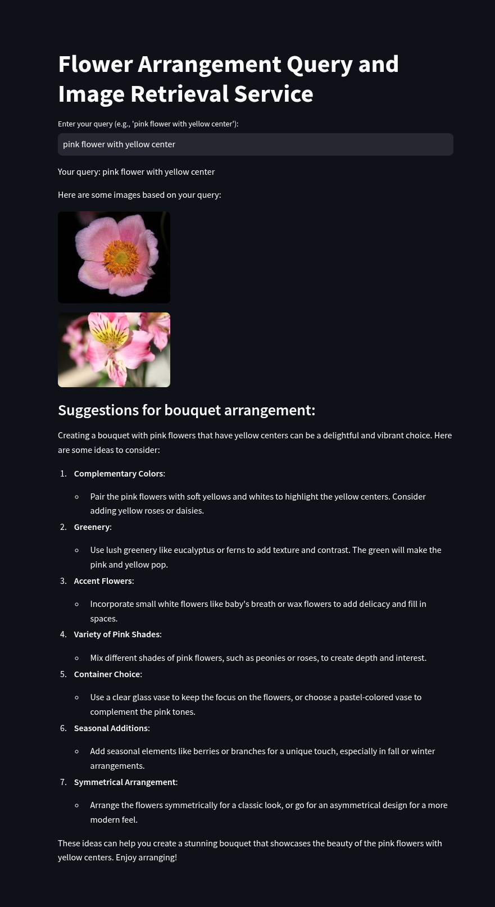

# Multimodal RAG Chatbot using ChromaDB, OpenAI, and Streamlit

## 📌 Overview
This project is a **Multimodal Retrieval-Augmented Generation (RAG) chatbot** that processes both text and images to provide contextually aware responses. It uses **ChromaDB** as the vector database, **OpenAI** for response generation, and **Streamlit** for an interactive frontend. The chatbot retrieves and generates answers based on relevant knowledge, ensuring accurate and meaningful interactions.

## 🎯 Who is it for?
- Businesses seeking **AI-powered customer support** with multimodal capabilities.
- Researchers and professionals needing **document and image-based knowledge retrieval**.
- Developers looking to **integrate RAG-based AI assistants** into their applications.

## 🚀 Features
- ✅ **Multimodal Input Processing** – Handles both text and images for enhanced interaction.
- ✅ **ChromaDB Vector Store** – Efficient retrieval of relevant document embeddings.
- ✅ **OpenAI-Powered Responses** – Generates intelligent and context-aware answers.
- ✅ **Streamlit Interface** – Provides a seamless and interactive user experience.
- ✅ **Retrieval-Augmented Generation (RAG)** – Combines knowledge retrieval with AI-generated responses.

## 🔧 Tech Stack
- **Application Interface:** Streamlit
- **LLM Provider:** OpenAI
- **Vector Database:** ChromaDB
- **Dataset:** Huggingface

## 🛠️ Project Setup
### 1. Clone the Repository
```bash
git clone https://github.com/yourusername/multimodal-rag-chatbot.git
cd multimodal-rag-chatbot
```

### 2. Set Up Python Environment (Python 3.10)
This project is developed using **Python 3.10**. Ensure you have Python 3.10 installed before proceeding.
```bash
# Create a virtual environment
python -m venv venv
source venv/bin/activate  # On Windows use `venv\Scripts\activate`
```

### 3. Install Dependencies
```bash
pip install -r requirements.txt
```

### 4. Set Up API Keys
Create a `.env` file in the root directory and add your OpenAI API key:
```ini
OPENAI_API_KEY=your_openai_api_key_here
```

### 5. Run the Streamlit App
```bash
streamlit run web_app.py
```

## Streamlit Screenshot



## 📌 Usage
1. Upload images.
2. Enter a question related to the uploaded content.
3. The chatbot retrieves relevant context and generates an AI-powered response.


## 📜 License
This project is licensed under the **MIT License**.

## 👨‍💻 Contributing
Pull requests are welcome! For major changes, please open an issue first to discuss what you’d like to modify.

## 📩 Contact
For inquiries, reach out via **developer.russel@gmail.com** or connect on **LinkedIn/Twitter/GitHub**.

---
🚀 **Empowering AI with Knowledge Retrieval & Multimodal Capabilities!**


